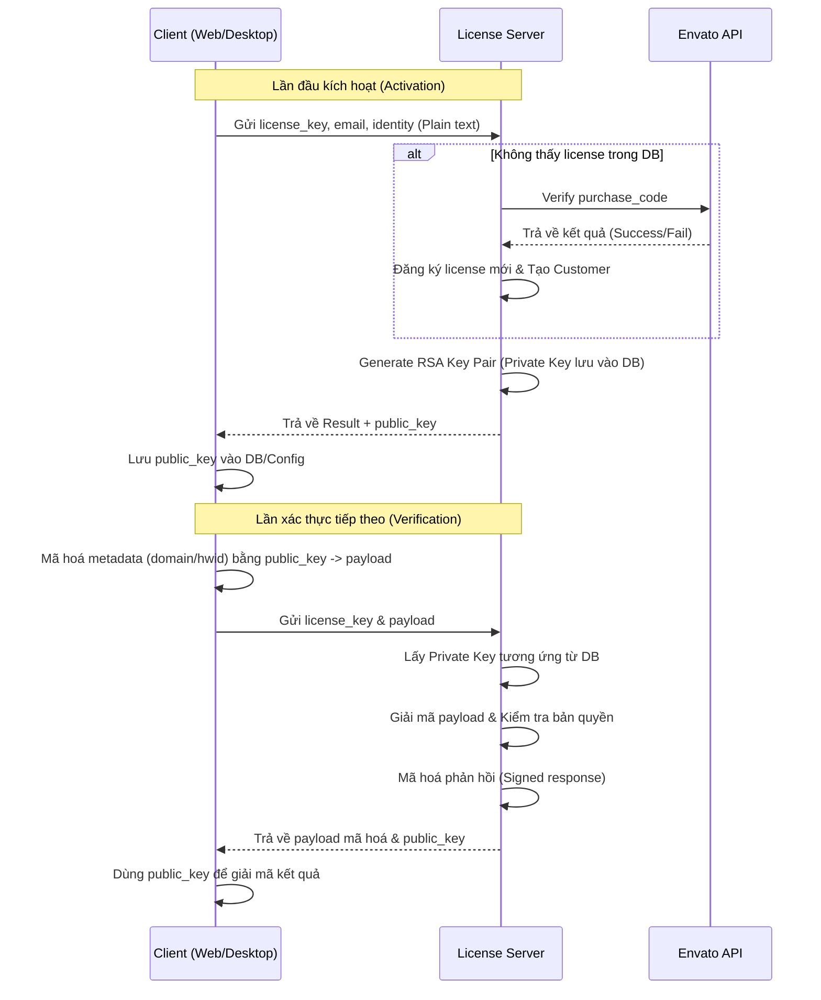

# Hướng dẫn tích hợp Xác thực License (API Flow)

Tài liệu này hướng dẫn các nhà phát triển (Web & Desktop) cách tích hợp luồng xác thực bản quyền với Optilarity License Server. Hệ thống hỗ trợ xác thực cả **Optilarity Direct License** và **Envato Purchase Code**.

---

## 1. Luồng hoạt động (Workflow)

Hệ thống sử dụng cơ chế **RSA-2048** để bảo mật dữ liệu. Khóa RSA được quản lý riêng biệt cho từng khách hàng (Customer).

1.  **Lần đầu xác thực (Activation)**: Client gửi dữ liệu thô (plain text). Server sẽ tạo Customer, Issue License (nếu là Envato), generate RSA Key và trả về **Public Key**.
    *   **LƯU Ý QUAN TRỌNG**: Client **BẮT BUỘC** phải lưu lại `public_key` này vào bộ nhớ an toàn (Database, File cấu hình, hoặc Registry) để sử dụng cho tất cả các lần verify sau này.
2.  **Từ lần thứ hai (Verification)**: Client sử dụng Public Key đã lưu để mã hóa dữ liệu thành `payload` trước khi gửi lên server.

### Sơ đồ luồng (Sequence Diagram)



---

## 2. API Endpoint

- **URL**: `https://optilarity.top/api/license/verify`
- **Method**: `POST` (Khuyên dùng) hoặc `GET`.

### Tham số yêu cầu (Request Parameters):

| Tham số | Loại | Bắt buộc | Mô tả |
| :--- | :--- | :--- | :--- |
| `license_key`| String | Có | Purchase Code (Envato) hoặc Optilarity License Key. |
| `email` | String | Có | Email của khách hàng mua sản phẩm. |
| `domain` | String | Không | Domain đang chạy phần mềm (Dành cho **Web App**). |
| `machine_id` | String | Không | Hardware ID / UUID của thiết bị (Dành cho **Desktop App**). |
| `payload` | String | Không | JSON data đã mã hóa RSA + Base64 (dùng từ lần verify thứ 2). |
| `version` | String | Không | Phiên bản phần mềm hiện tại của client. |

---

## 3. Cấu trúc phản hồi (Response Structure)

Mọi phản hồi đều được trả về dưới dạng JSON thô, bên trong chứa `payload` đã được server mã hóa bằng Private Key.

```json
{
  "success": true,
  "payload": "BASE64_ENCRYPTED_STRING...",
  "public_key": "-----BEGIN PUBLIC KEY-----\n...",
  "timestamp": 1740446400
}
```

### Dữ liệu sau khi giải mã `payload`:

| Trường | Loại | Mô tả |
| :--- | :--- | :--- |
| `valid` | Boolean | `true` nếu license hợp lệ và được phép hoạt động. |
| `license_type` | String | `optilarity`, `envato`, hoặc `membership`. |
| `license_mode` | String | `strict` (1 site/thiết bị) hoặc `share` (nhiều site/thiết bị). |
| `expires_at` | String | Ngày hết hạn (YYYY-MM-DD), `null` nếu là trọn đời. |
| `can_update` | Boolean | `true` nếu còn trong hạn update phần mềm. |
| `message` | String | Thông báo chi tiết từ server. |

---

## 4. Hướng dẫn tích hợp (Examples)

### 4.1 Cho Web App (PHP/WordPress)

Sử dụng `domain` để định danh instance. Client nên lưu Public Key vào `wp_options` hoặc bảng cấu hình tương đương.

```php
$license_key = 'YOUR_PURCHASE_CODE';
$email = 'client@email.com';
$domain = $_SERVER['HTTP_HOST'];
$public_key = get_option('optilarity_public_key');

if (!$public_key) {
    // 1. Kích hoạt lần đầu để lấy Public Key
    $response = wp_remote_post('https://optilarity.top/api/license/verify', [
        'body' => ['license_key' => $license_key, 'email' => $email, 'domain' => $domain]
    ]);
    $data = json_decode(wp_remote_retrieve_body($response), true);
    
    if ($data['success'] && !empty($data['public_key'])) {
        update_option('optilarity_public_key', $data['public_key']);
        $public_key = $data['public_key'];
    }
}

// 2. Các lần xác thực sau: BẮT BUỘC dùng Public Key để mã hóa payload
if ($public_key) {
    // Mã hóa dữ liệu trước khi gửi để bảo mật tuyệt đối
    // (Xem chi tiết logic mã hóa tại mục 2. API Endpoint)
}
```

### 4.2 Cho Desktop App (C# / Python / C++)

Sử dụng `machine_id` (HWID) thay cho domain để định danh thiết bị.

**Ví dụ logic (Python):**
```python
import platform
import hashlib
import requests

def get_machine_id():
    # Tạo mã định danh duy nhất cho phần cứng
    node = platform.node()
    proc = platform.processor()
    return hashlib.sha256(f"{node}{proc}".encode()).hexdigest()

license_key = "CLIENT-KEY"
email = "user@email.com"
hwid = get_machine_id()

# Gửi yêu cầu kích hoạt
data = {
    "license_key": license_key,
    "email": email,
    "machine_id": hwid
}
response = requests.post("https://optilarity.top/api/license/verify", json=data)
# Xử lý RSA key nhận được để dùng cho lần sau...
```

---

## 5. Lưu ý quan trọng

1.  **Định danh thiết bị**: Đối với Desktop App, bạn nên sử dụng các mã định danh phần cứng không đổi (như UUID của Mainboard hoặc CPU ID) để tránh trường hợp người dùng cài lại Windows làm thay đổi Identity.
2.  **Strict Mode**: Với `license_mode: strict`, hệ thống sẽ khóa bản quyền vào `domain` hoặc `machine_id` đầu tiên thực hiện verify thành công.
3.  **Bảo mật RSA**: Bắt buộc sử dụng mã hóa RSA từ lần verify thứ 2 để chống lại các tool "Crack" bằng cách giả lập local server hoặc sửa package truyền tin.
4.  **Lưu trữ Public Key**: Public Key được trả về ở lần kích hoạt đầu tiên là "chìa khóa" duy nhất để client có thể nói chuyện bảo mật với server. Nếu client làm mất khóa này, server sẽ không thể giải mã `payload` gửi lên và client cũng không thể giải mã kết quả trả về. Hãy đảm bảo khóa này được lưu trữ bền vững trên thiết bị của người dùng.
